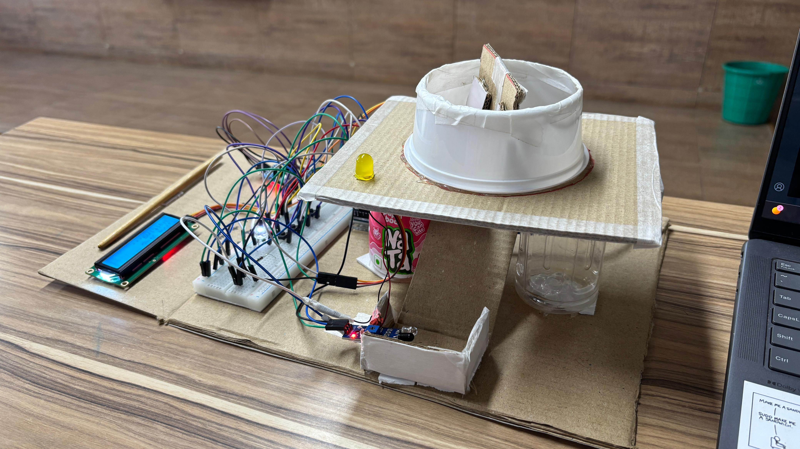

# 💊 Smart Medicine Reminder Box

An Arduino-based smart medicine reminder that alerts you at scheduled times, automatically dispenses medicine using a servo motor, and confirms intake using an IR sensor — all displayed on a 16x2 LCD screen.

---

## Features

- Set up to **3 daily medicine alarms**
- **Servo motor** rotates to dispense medicine when alarm triggers
- **Buzzer + Blue LED** alert when it's time to take medicine
- **IR sensor** detects when medicine has been taken
- **16x2 LCD** displays current date, time, and system status
- Simple **3-button interface** to set and navigate alarms

---

## Components / Hardware Used

| Component | Details |
|---|---|
| Arduino | Uno / Nano |
| RTC Module | DS3231 |
| LCD Display | 16x2 with I2C module (address 0x27) |
| Servo Motor | Standard servo |
| IR Sensor | Digital IR obstacle sensor |
| Buzzer | Active buzzer |
| LEDs | 1x White, 1x Blue |
| Push Buttons | 4x (Set, Increment, Decrement, Next) |

---

## Libraries Required

Install these via **Arduino IDE → Tools → Manage Libraries**:

- `Wire` (built-in)
- `LiquidCrystal_I2C`
- `RTClib` by Adafruit
- `Servo` (built-in)

---

## Pin Configuration

| Component | Pin |
|---|---|
| Button - Set | D2 |
| Button - Increment | D3 |
| Button - Decrement | D4 |
| Button - Next | D5 |
| Servo Motor | D6 |
| IR Sensor | D7 |
| Buzzer | D8 |
| Blue LED | D9 |
| White LED | D10 |
| LCD (I2C) | SDA / SCL |
| RTC (I2C) | SDA / SCL |

---

## How to Use

1. Wire up all components as per the pin configuration above
2. Install the required libraries in Arduino IDE
3. Open `final_draft.ino` and upload it to your Arduino
4. **After the first upload**, comment out this line to prevent the time from resetting every reboot:
   ```cpp
   // rtc.adjust(DateTime(F(__DATE__), F(__TIME__)));
   ```
5. Re-upload the code after commenting out that line

### Setting an Alarm
1. Press the **SET** button to enter alarm-setting mode
2. Use **INC / DEC** buttons to adjust the minutes
3. Press **NEXT** to switch between Alarm 1, 2, and 3
4. Press **SET** again to save — the LCD will display *"ALARM IS SET"*

### When the Alarm Triggers
- The LCD shows *"Take Medicine"*
- The servo rotates to dispense medicine
- The buzzer beeps and the blue LED turns on
- Once the IR sensor detects the medicine has been removed, the system confirms with *"Medicine Taken"* and resets

---

## Important Note

> After uploading the code for the **first time**, always comment out the following line:
> ```cpp
> rtc.adjust(DateTime(F(__DATE__), F(__TIME__)));
> ```
> If left uncommented, the RTC will reset to the compile time every time the Arduino restarts, causing your alarms to behave incorrectly.

---

## Project Photo



